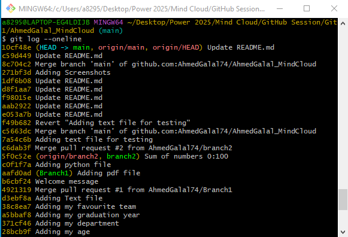

# **AhmedGalal_MindCloud**
GitHub task for Mind Cloud
## **My Personal data**
### **My name**
`Ahmed Galal Fathallah`
### **My age**
19
### **My department**
Electrical Power and Machines
### **My favourite team**
Software
## **Clonning my repo**
- you can clone my repo by the following command
```
git clone https://github.com/AhmedGalal74/AhmedGalal_MindCloud.git
```
## **Following me on GitHub**
- you can find my GitHub account [Here](https://github.com/AhmedGalal74)
# **The required screenshots**
## **Commits**

## **Pull request**
### **Open a pull request**
Create a new pull request by comparing changes across two branches.

